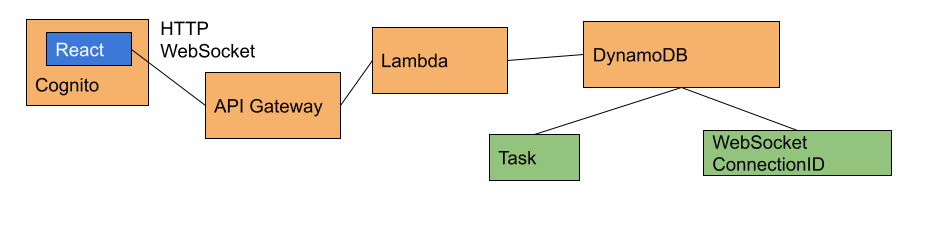

# Rick ToDo
トレロを参考にしたタスク管理アプリ

## 動作確認方法
### 公開アプリ
https://ricktodo.s3-ap-northeast-1.amazonaws.com/index.html

### ローカル
```
git clone git@github.com:rikuTanide/riku_todo.git
cd riku_todo/web
yarn install
yarn start or yarn test
```

## 仕様

### 機能

#### アプリケーションの概要
  1. ログインする
  1. タスクを登録
  1. 進捗を入力
  1. タスクはすべてのメンバーで共有される


#### 機能＞会員機能
   - 会員登録
   - ログイン
   - ログアウト
#### 機能＞タスク入力機能
   - 作成
   - 閲覧
   - 編集
   - 進捗状態入力
   - 削除
#### UIのルール
 - レスポンシブ
   - PC版
   - スマホ版
   - PC版とスマホ版で同じURLが同じ意味のページを指すようにする
 - 楽観的UI
 - ネットワークエラーは再実行できる
 - 確認ダイアログをださない
 - Undo/Redoができる
 - ブラウザ間で自動同期

#### エラーハンドルのルール
 - サーバーから来たJSONをajvで検証
 - ネットワークは10秒でタイムアウトとする
 - 書き込み中の文章はlocalStorageに保存し  
   リロードしても残るようにする
---

## 技術詳細



## 技術選定

### サーバー・フロントエンド共通

|目的|技術|
|---|---|
|言語|TypeScript|
|テスト|Jest|
|フォーマッター|Prettier|
|JSONのバリデーション|Ajv|

### サーバーサイド

|目的|技術|
|---|---|
|REST API|Amazon API GatewayとAWS Lambda|
|WebSocketエンドポイント|Amazon API GatewayとAWS Lambda|
|DB|Amazon DynamoDB|
|構成管理|Serverless Framework|


### フロントエンド

|目的|技術|
|---|---|
|会員機能|Amazon Cognito|
|ビューライブラリ|React|
|HttpClient|Axios|
|UIフレームワーク|Material-UI|
|イベントハンドリング|RxJS|

## フロントエンドのアーキテクチャ

### テーマ

 - ビューとビジネスロジックを切り離す
 - ビジネスロジックが純粋関数になるようにする

### 手段
#### ビューとビジネスロジックを切り離すために
ビューとビジネスロジックの接続点はRxJSのみ  
- ビュー <-- 状態 -- ビジネスロジック  
- ビュー -- 操作イベント --> ビジネスロジック  

#### ビジネスロジックが純粋関数になるようにするために
純粋関数にならない部分はサービスとして引数でいれる

 - 現在時刻
 - ログイン
 - HttpClient
 - History API
 - ローカルストレージ

### テスト戦略
#### テスト戦略＞UIのテスト
 *テストコードは書かない*
##### 理由
 - 手数の割に得るものが少ない
 - f(state) = UIが維持できていれば実機確認が容易

#### テスト戦略＞ビジネスロジックのテスト
##### 方針

現在の状態と操作のイベントを引数に  
次の状態を正しく返せているかと  
正しく副作用を起こせているかをテスト。  

副作用のテストは各サービスのモックを作りJestの機能でspy。

### コードの説明
#### このアプリが持つ状態の一覧
src/Types/State.ts PageState/LoginPageState
#### このアプリで発生する操作イベント一覧
src/Types/Event.ts Event/LoginPageEvent
#### エントリーポイント
src/index.ts
#### 各サービスの実体化
src/showMembersPage.tsx BindBusinessLogicWrapper
#### RxJSを使ったビジネスロジックとUIの接続
src/showMembersPage.tsx BindBusinessLogicWrapper
#### 操作イベントを操作のハンドラに割り振る処理
src/Model/MembersPageModel.ts createHandler#handler  
src/Model/NonMembersPageModel.ts createHandler#handler  
#### 各操作イベントのハンドラ
src/Model/MembersPageModel.ts
src/Model/NonMembersPageModel.ts
#### 端末によるUIの切り替え
src/showMembersPage.tsx MediaQueryWrapper

### パフォーマンス対策

#### Code Split
PC用画面とスマホ用画面をのコードを分割

#### メモ化
どのような操作が行われようと  
Taskオブジェクトの配列に変更がなければタスク一覧のView（以下ボード）の表示が変わることがない。  
React.memoを使い、ボードをTaskの配列に対してメモ化する。  


---

## ページ
URLはハッシュURLを使う。
理由：キャッシュ効率とサーバー側の設定項目削減のため

### スマホ
#### 未完了タスク
/
#### 完了タスク
/?progress=complete
#### ゴミ箱
/?trash=true
#### 新規作成
/new
#### 編集
/tasks/:task_id/edit
#### 削除
/tasks/:task_id/delete
#### マイページ
/mypage

### PC
#### 未完了タスク/完了タスク/ゴミ箱
/
#### 新規作成
/new
#### 編集
/tasks/:task_id/edit
#### 削除
/tasks/:task_id/delete
#### マイページ
/mypage

## REST API Endpoint

### タスク一覧
GET /tasks?summary=true
この項目だけ取得される
 - タイトル
 - 完了/未完了
 - ゴミ箱    
 - 作成時刻
 
### タスク作成
POST /tasks
成功した場合は201

### タスク詳細
GET /tasks/:task_id

### タスク編集
PATCH /tasks/:task_id
```
{
  "title": "タイトル",
  "body": "本文"
}
```
成功した場合は200

### 進捗入力

PUT /tasks/:task_id/progress
```
"continue" | "complete"
```

### ゴミ箱に入れる
PUT /tasks/:task_id/trash
```
"" | "trash"
```

### タスク削除
DELETE /tasks/:task_id

### WebSocketエンドポイント
何かメッセージを送ればすべてのWebSocket Connectionに空のメッセージが送られるようにする

--- 
## 時間があれば作る
 - puppeteerでe2eテストをする
 - PCとスマホのコードをmedia queryで先読み
 