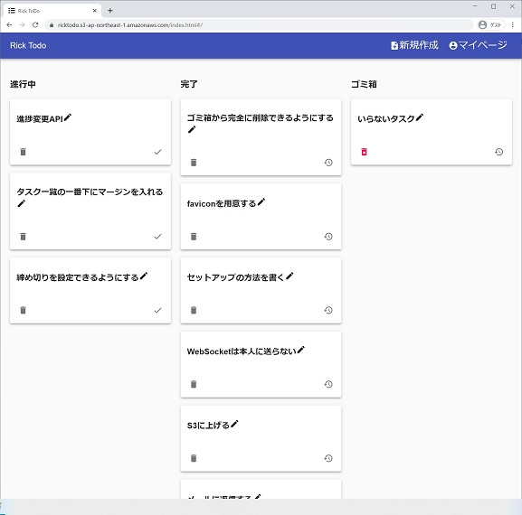

<!-- 
$theme: gaia
template: invert
-->

Trello風タスク管理アプリ
# Rick ToDo

---
# 概要
 - こだわったこと
 - アプリの説明
 - 技術詳細
   - アーキテクチャ
   - テスト戦略

---

# こだわったこと

 1. 未経験な技術に取り組む
    - サーバーサイド
      - Serverless Framework
      - Amazon API GatewayでWebSocketを使う
      - Amazon Cognito
    - フロントエンド
      - 細やかなエラーハンドリング
      - Undo/RedoのUI 
 1. 開発速度
     1. 1/22(金) 19:00 課題をいただく
     1. (1/23(土) 一日用事)
     1. 1/24(日) 16時間で完了

--- 
### アプリケーションの説明>機能
#### アプリケーションの概要
  1. ログインする
  1. タスクを登録
  1. 進捗を入力
  1. タスクはすべてのメンバーで共有される

---
#### アプリケーションの説明＞機能＞会員機能
   - 会員登録
   - ログイン
   - ログアウト
---
#### アプリケーションの説明＞機能＞タスク入力機能
   - 作成
   - 閲覧
   - 編集
   - 進捗状態入力
   - 削除
---

#### 機能＞UIのルール
##### 機能＞UIのルール＞レスポンシブ
   - PC版
   - スマホ版
   - PC版とスマホ版で同じURLが同じ意味のページを指すようにする

 

---

##### 機能＞UIのルール＞楽観的UI

---

##### 機能＞UIのルール＞ネットワークエラーは再実行できる

---

##### 機能＞UIのルール＞Undoができる

  
---

##### 機能＞UIのルール＞ブラウザ間で自動同期

---

#### エラーハンドルのルール
 - サーバーから来たJSONをajvで検証
 - ネットワークは10秒でタイムアウトとする
 - 書き込み中の文章はlocalStorageに保存し  
   リロードしても残るようにする

---

## 全体像

---

## 技術選定

---

### 技術選定＞サーバー・フロントエンド共通

|目的|技術|
|---|---|
|言語|TypeScript|
|テスト|Jest|
|フォーマッター|Prettier|
|JSONのバリデーション|Ajv|

---

### 技術選定＞サーバーサイド

|目的|技術|
|---|---|
|REST API|Amazon API GatewayとAWS Lambda|
|WebSocketエンドポイント|Amazon API GatewayとAWS Lambda|
|DB|Amazon DynamoDB|
|構成管理|Serverless Framework|

---

### 技術選定＞フロントエンド

|目的|技術|
|---|---|
|会員機能|Amazon Cognito|
|ビューライブラリ|React|
|HttpClient|Axios|
|UIフレームワーク|Material-UI|
|イベントハンドリング|RxJS|

---

## フロントエンドのアーキテクチャ

### お断り
 - 特にこの方法を押し付けたいわけではない
 - うまくいく方法の一つ

---

### フロントエンドのアーキテクチャ＞テーマ

 - ビューとビジネスロジックを切り離す
 - ビジネスロジックが純粋関数になるようにする

--- 

### フロントエンドのアーキテクチャ＞手段
#### ビューとビジネスロジックを切り離すために
ビューとビジネスロジックの接続点はRxJSのみ  
- ビュー <-- 状態 -- ビジネスロジック  
- ビュー -- 操作イベント --> ビジネスロジック  

--- 

### フロントエンドのアーキテクチャ＞手段
#### ビジネスロジックが純粋関数になるようにするために
純粋関数にならない部分はサービスとして引数でいれる

 - 現在時刻
 - ログイン
 - HttpClient
 - History API
 - ローカルストレージ

---

### テスト戦略

---

#### テスト戦略＞UIのテスト
 *テストコードは書かない*
##### 理由
 - 手数の割に得るものが少ない
 - f(state) = UIが維持できていれば実機確認が容易

---

#### テスト戦略＞ビジネスロジックのテスト
##### 方針

現在の状態と操作のイベントを引数に  
次の状態を正しく返せているかと  
正しく副作用を起こせているかをテスト。  

副作用のテストは各サービスのモックを作りJestの機能でspy。

---

## その他技術的こだわり

---

## その他技術的こだわり
### パフォーマンス対策

#### Code Split
PC用画面とスマホ用画面をのコードを分割

#### メモ化
どのような操作が行われようと  
Taskオブジェクトの配列に変更がなければタスク一覧のView（以下ボード）の表示が変わることがない。  
React.memoを使い、ボードをTaskの配列に対してメモ化する。  

---

## その他技術的こだわり
## ページのURL
URLはハッシュURLを使う。  
理由：キャッシュ効率とサーバー側の設定項目削減のため

---

## その他技術的こだわり
## REST API Endpoint
- RESTの考え方に準拠
- より実践を意識し全タスク取得APIはサマリー

GET /tasks?summary=true  
POST /tasks  
GET /tasks/:task_id  
PATCH /tasks/:task_id  
PUT /tasks/:task_id/progress  
PUT /tasks/:task_id/trash  
DELETE /tasks/:task_id  
